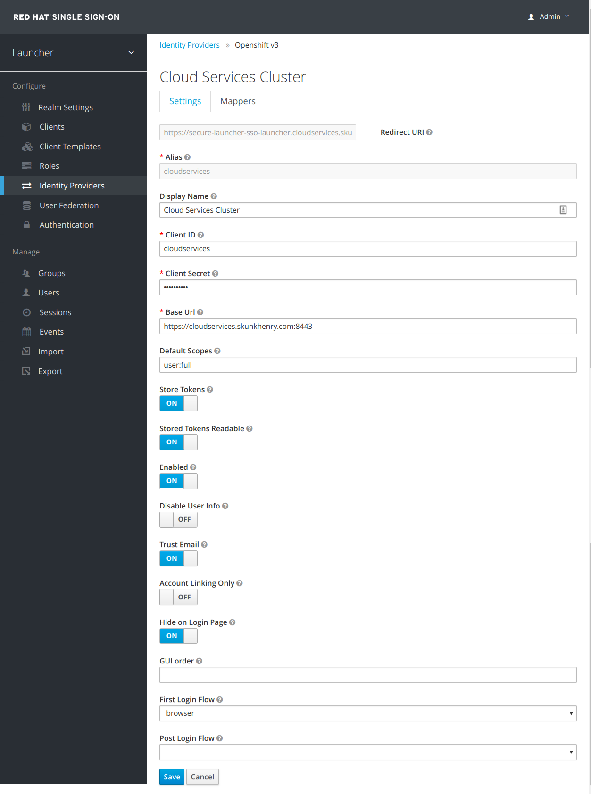

Add below to keycloak `DeploymentConfig`

```yaml
      - name: JAVA_OPTS
        value: -Djavax.net.ssl.trustStore=/opt/jboss/keycloak/standalone/data/keystore/application.keystore -Djavax.net.ssl.trustStorePassword=Password1 -Xms64m -Xmx512m -XX:MetaspaceSize=96M -XX:MaxMetaspaceSize=256m -Djava.net.preferIPv4Stack=true -Djboss.modules.system.pkgs=org.jboss.byteman -Djava.awt.headless=true
```

Get cert for OpenShift Master

```bash
echo -n "" | openssl s_client -connect cloudservices.skunkhenry.com:8443 | sed -ne '/-BEGIN CERTIFICATE-/,/-END CERTIFICATE-/p' > /tmp/cert.pem
```

Copy script & cert to pod

```bash
oc cp `pwd`/configure-keystore.sh che/keycloak-2-cprcf:/opt/jboss/keycloak/standalone/data/keystore/configure-keystore.sh
oc cp /tmp/cert.pem che/keycloak-2-cprcf:/opt/jboss/keycloak/standalone/data/keystore/cert.pem
```

Configure the keystore

```bash
oc exec --namespace che keycloak-2-cprcf bash /opt/jboss/keycloak/standalone/data/keystore/configure-keystore.sh Password1
```


Create an OAuthClient in OpenShift

```bash
oc create -f oauthclient.yml
```

Create an OpenShift Identify Provider in Keycloak



Create a Github OAuth Client

* TODO

Create a Github Identity Provider in Keycloak

